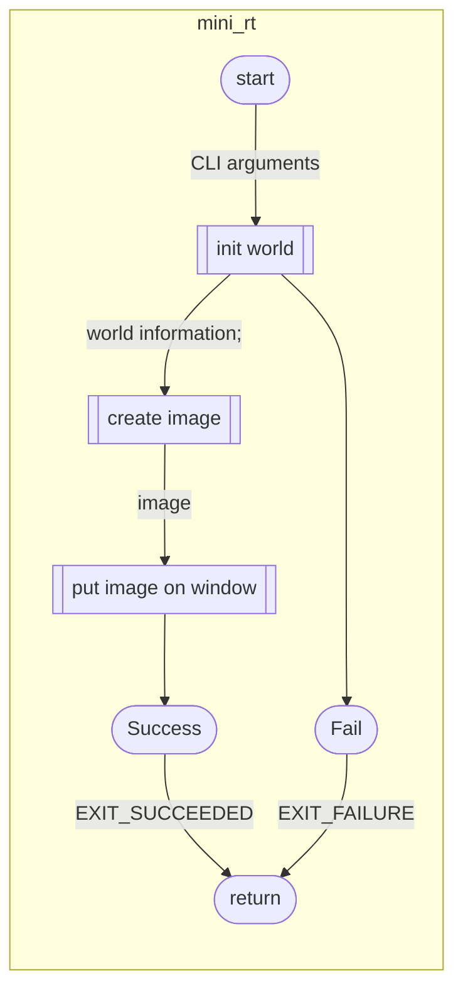
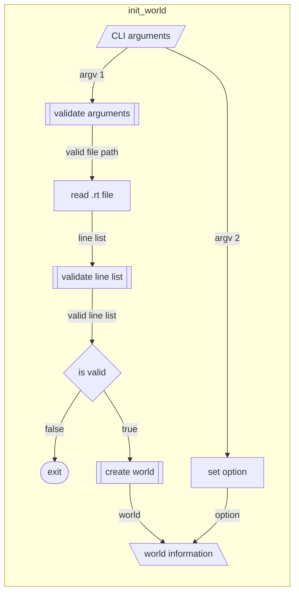
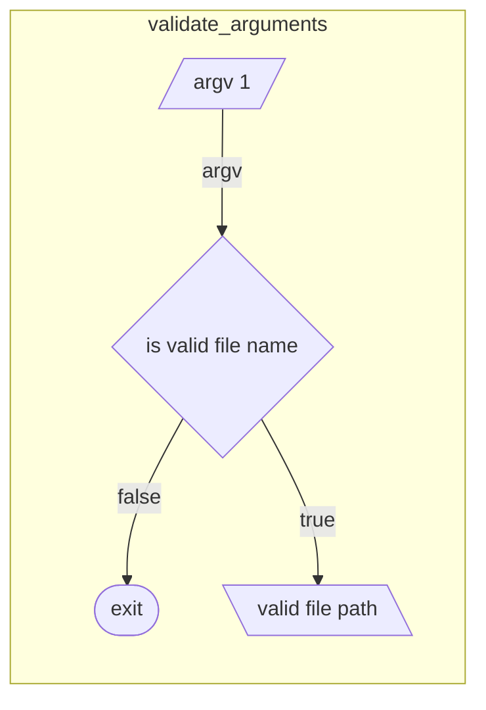
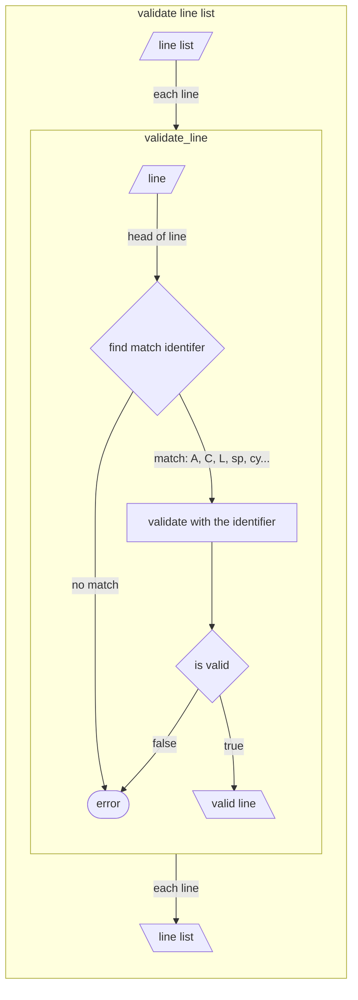

```mermaid
flowchart

subgraph mini_rt
		direction TB
	start([start])-->|CLI arguments|m2[[init world]]
	m2-->|world information;|m3[[create image]]
	m3-->|image|m5[[put image on window]]
	m5-->yes([Success])

	m2-->no([Fail])
	yes-->|EXIT_SUCCEEDED|r
	no-->|EXIT_FAILURE|r([return])
end

```

```mermaid
flowchart
	subgraph	init_world
		direction TB
		input[/CLI arguments/]-->|argv 1|sw1
		sw1[[validate arguments]]-->|valid file path|sw2
		sw2[read .rt file]-->|line list|sw3[[validate line list]]
		sw3-->|valid line list|if1{is valid}
		if1-->|false|e([exit])
		if1-->|true|sw4[[create world]]
		sw4-->|world|output[\world information\]
		input-->|argv 2|sw5[set option]
		sw5-->|option|output
	end
```

```mermaid
flowchart
	subgraph validate_arguments
		direction TB
		input[/argv 1/]-->|argv|if1{is valid file name}
		if1-->|false|error([exit])
		if1-->|true|output[\valid file path\]
	end
```

```mermaid
flowchart
	subgraph validate_line_list [validate line list]
		direction TB
		input[/line list/]-->|each line|validate_line
		subgraph validate_line
			direction TB
			vlin[/line/]-->|head of line|if1{find match identifer}
			if1-->|no match|error
			if1-->|match: A, C, L, sp, cy...|vl2[validate with the identifier]
			vl2-->if2{is valid}
			if2-->|true|vlout[\valid line\]
			if2-->|false|error
			error([error])
		end
		validate_line-->|each line|output[\line list\]
	end
```
