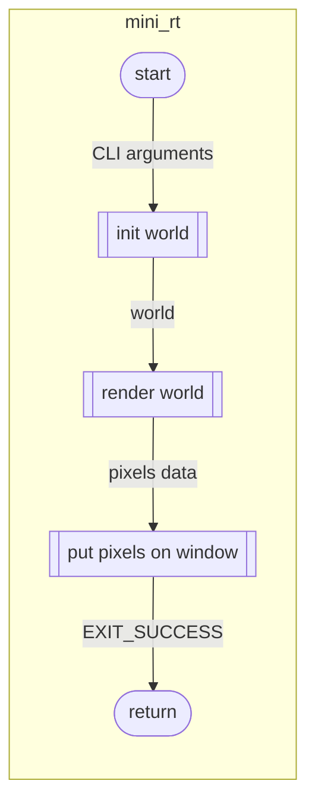
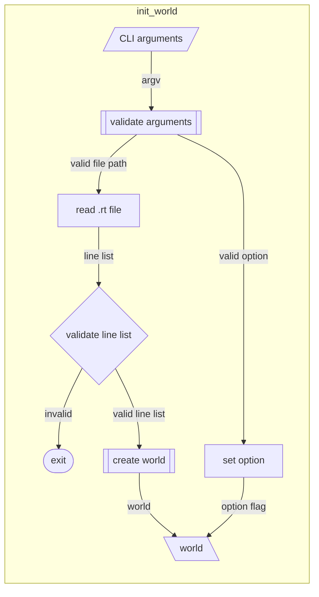
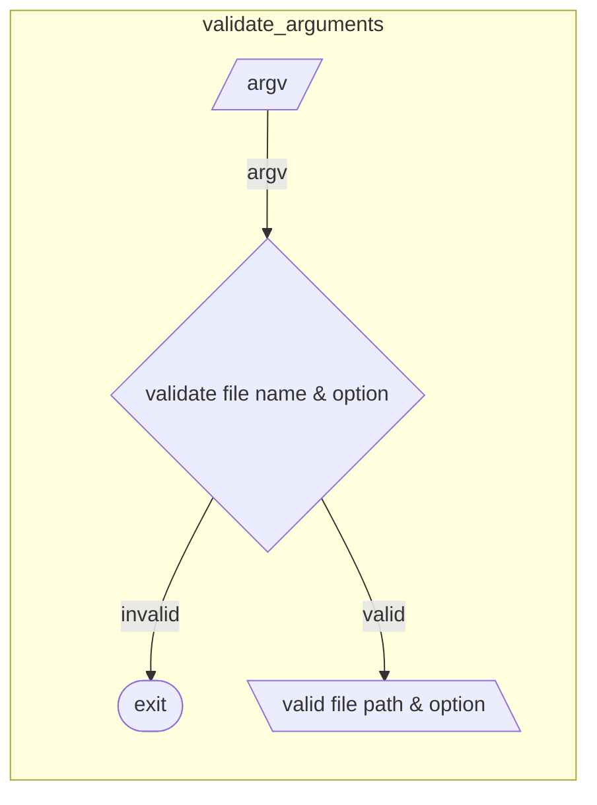
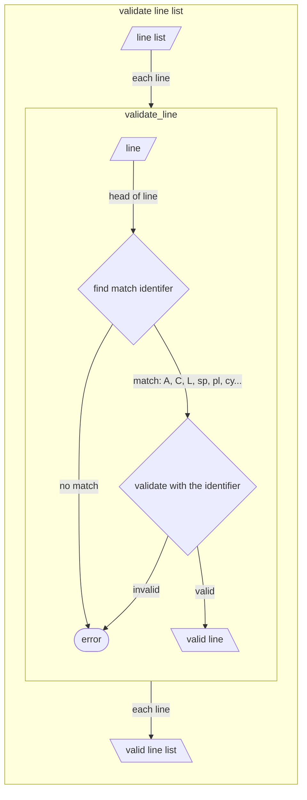
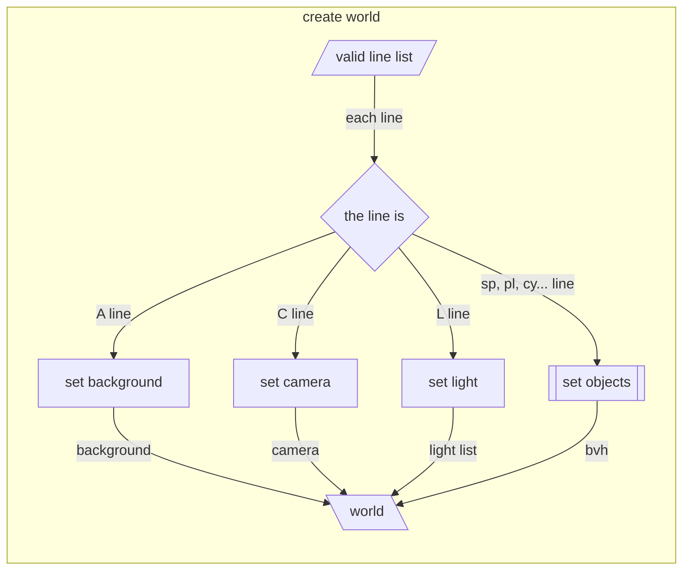
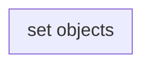
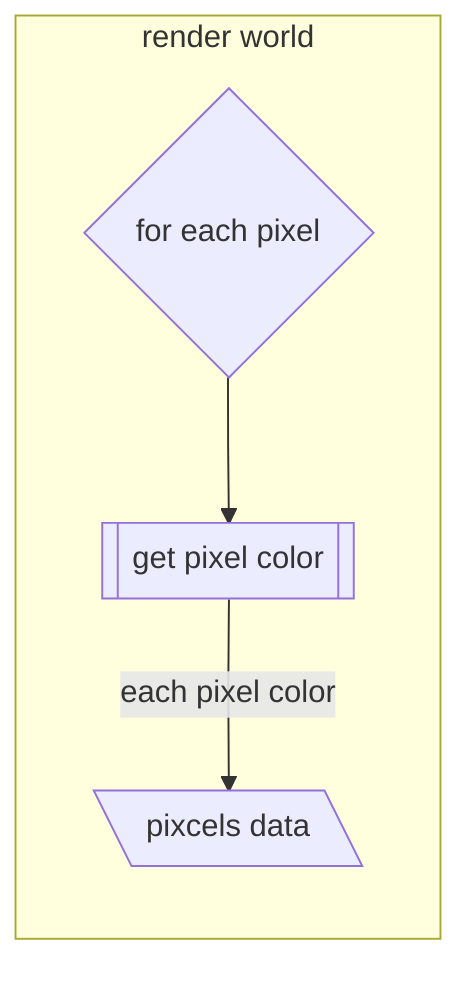
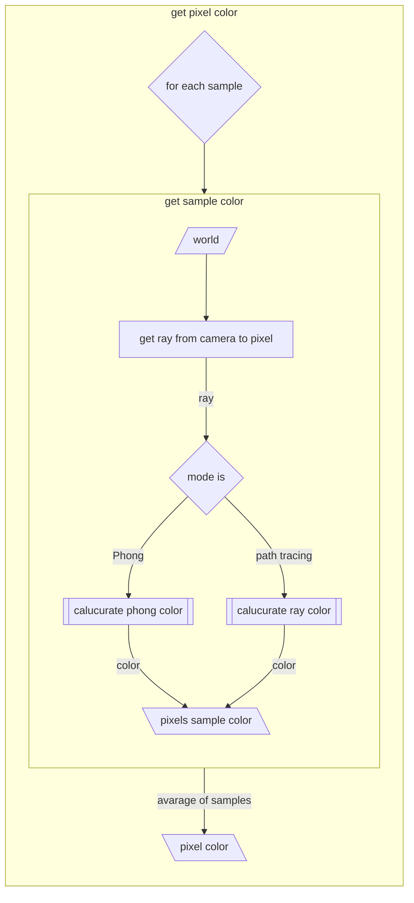

## next to do
- put pixels on window
- set objects
- calucurate phong color
- calucurate ray color

```mermaid
flowchart

subgraph mini_rt
		direction TB
	start([start])-->|CLI arguments|m1[[init world]]
	m1-->|world|m2[[render world]]
	m2-->|pixels data|m3[[put pixels on window]]
	m3-->|EXIT_SUCCESS|r([return])
end

```

```mermaid
flowchart
	subgraph	init_world
		direction TB
		input[/CLI arguments/]-->|argv|sw1
		sw1[[validate arguments]]-->|valid file path|sw2
		sw2[read .rt file]-->|line list|if1{validate line list}
		if1-->|invalid|e([exit])
		if1-->|valid line list|sw4[[create world]]
		sw4-->|world|output[\world\]
		sw1-->|valid option|sw5[set option]
		sw5-->|option flag|output
	end
```

```mermaid
flowchart
	subgraph validate_arguments
		direction TB
		input[/argv/]-->|argv|if1{validate file name & option}
		if1-->|invalid|exit([exit])
		if1-->|valid|output[\valid file path & option\]
	end
```

```mermaid
flowchart
	subgraph validate_line_list [validate line list]
		direction TB
		input[/line list/]-->|each line|validate_line
		subgraph validate_line
			direction TB
			vlin[/line/]-->|head of line|if1{find match identifer}
			if1-->|no match|error
			if1-->|match: A, C, L, sp, pl, cy...|if2{validate with the identifier}
			if2-->|valid|vlout[\valid line\]
			if2-->|invalid|error
			error([error])
		end
		validate_line-->|each line|output[\valid line list\]
	end
```

```mermaid
flowchart
	subgraph create_world [create world]
		direction TB
		input[/valid line list/]-->|each line|for{the line is}
		for-->|A line|cw1[set background]
		for-->|C line|cw2[set camera]
		for-->|L line|cw3[set light]
		for-->|sp, pl, cy... line|cw4[[set objects]]
		cw1-->|background|output
		cw2-->|camera|output
		cw3-->|light list|output
		cw4-->|bvh|output[\world\]
	end
```

```mermaid
flowchart
	subgraph set_objects [set objects]
		direction TB
	end
```

```mermaid
flowchart
	subgraph render_world [render world]
		direction TB
		for{for each pixel}-->get_pixel[[get pixel color]]
		get_pixel-->|each pixel color|output[\pixcels data\]
	end
```

```mermaid
flowchart
	subgraph get_pixel [get pixel color]
		direction TB
		for{for each sample}-->get_sample_color
		subgraph get_sample_color [get sample color]
			direction TB
			input[/world/]-->gp1[get ray from camera to pixel]
			gp1-->|ray|if1{mode is}
			if1-->|Phong|gp2[[calucurate phong color]]
			if1-->|path tracing|gp3[[calucurate ray color]]
			gp2 & gp3-->|color|r[\pixels sample color\]
		end
		get_sample_color-->|avarage of samples|output[\pixel color\]
	end
```