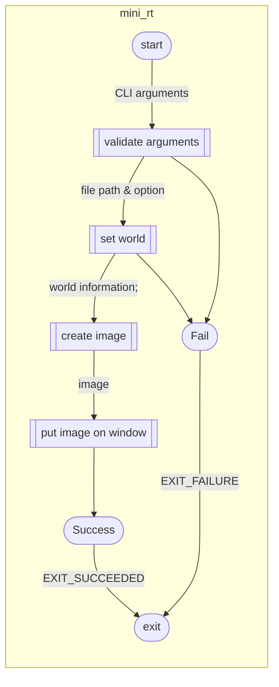
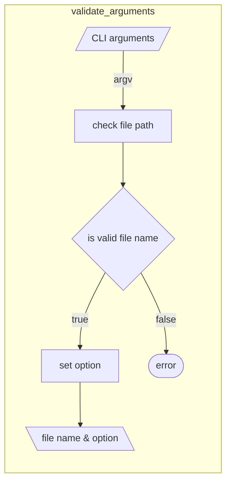
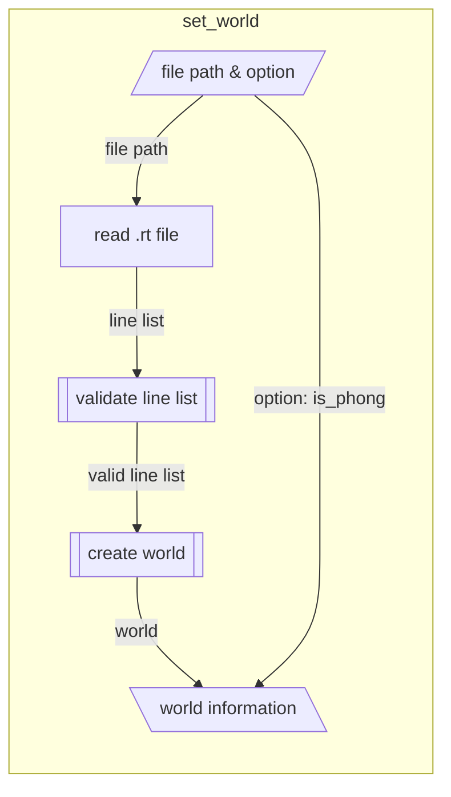
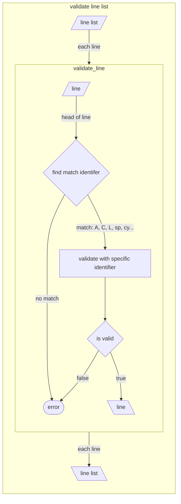

```mermaid
flowchart

subgraph mini_rt
		direction TB
	start([start])-->|CLI arguments|m1[[validate arguments]]
	m1-->|file path & option|m2[[set world]]
	m2-->|world information;|m3[[create image]]
	m3-->|image|m5[[put image on window]]
	m5-->yes([Success])

	m1-->no([Fail])
	m2-->no
	yes-->|EXIT_SUCCEEDED|exit
	no-->|EXIT_FAILURE|exit([exit])
end

```

```mermaid
flowchart
	subgraph validate_arguments
		direction TB
		input[/CLI arguments/]-->|argv|va1[check file path]
		va1-->if1{is valid file name}
		if1-->|true|va2[set option]
		if1-->|false|error([error])
		va2-->output[\file name & option\]
	end
```

```mermaid
flowchart
	subgraph set_world
		direction TB
		input[/file path & option/]-->|file path|sw2
		sw2[read .rt file]-->|line list|sw3[[validate line list]]
		sw3-->|valid line list|sw4[[create world]]
		sw4-->|world|output[\world information\]
		input-->|option: is_phong|output
	end
```

```mermaid
flowchart
	subgraph validate_line_list [validate line list]
		direction TB
		input[/line list/]-->|each line|validate_line
		subgraph validate_line
			direction TB
			vlin[/line/]-->|head of line|if1{find match identifer}
			if1-->|no match|error
			if1-->|match: A, C, L, sp, cy...|vl2[validate with specific identifier]
			vl2-->if2{is valid}
			if2-->|true|vlout[\line\]
			if2-->|false|error
			error([error])
		end
		validate_line-->|each line|output[\line list\]
	end
```
